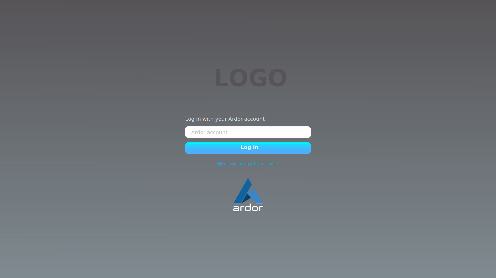
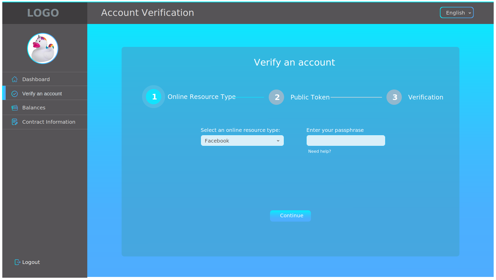

# WebClient
Initial thoughts about a web client for the IdentityVerification contract. It's inspired by a competitor from the hackathon who has [built](https://github.com/aajajim/identityVerifier) a really nice [frontend](https://aajajim.github.io/identityVerifier/sessions/login) to demonstrate the goal of the Identity Verification hackathon Challenge.

## Login Screen

## Account Verification

